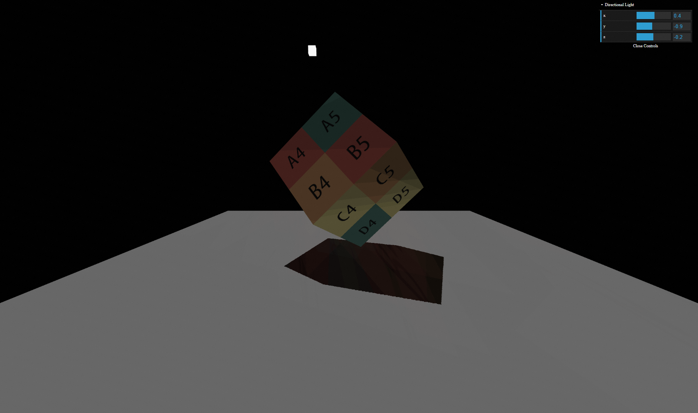
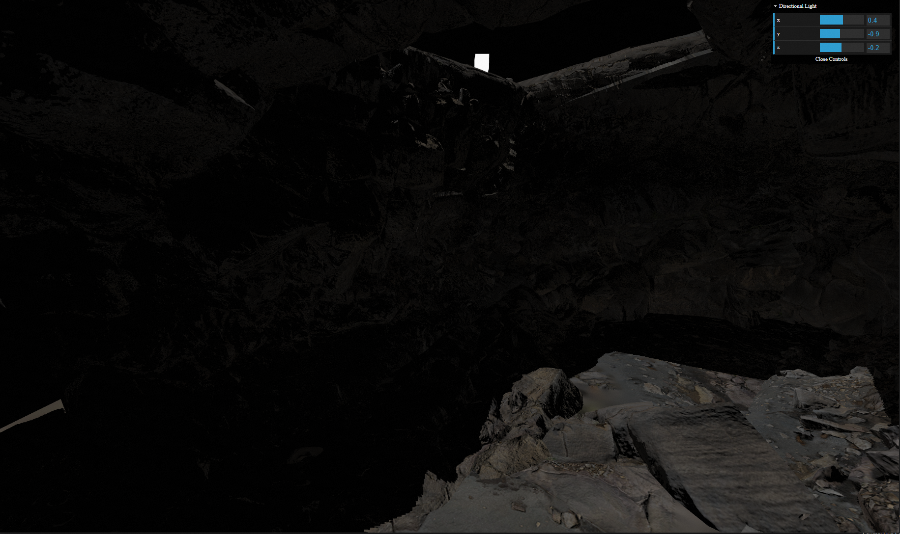
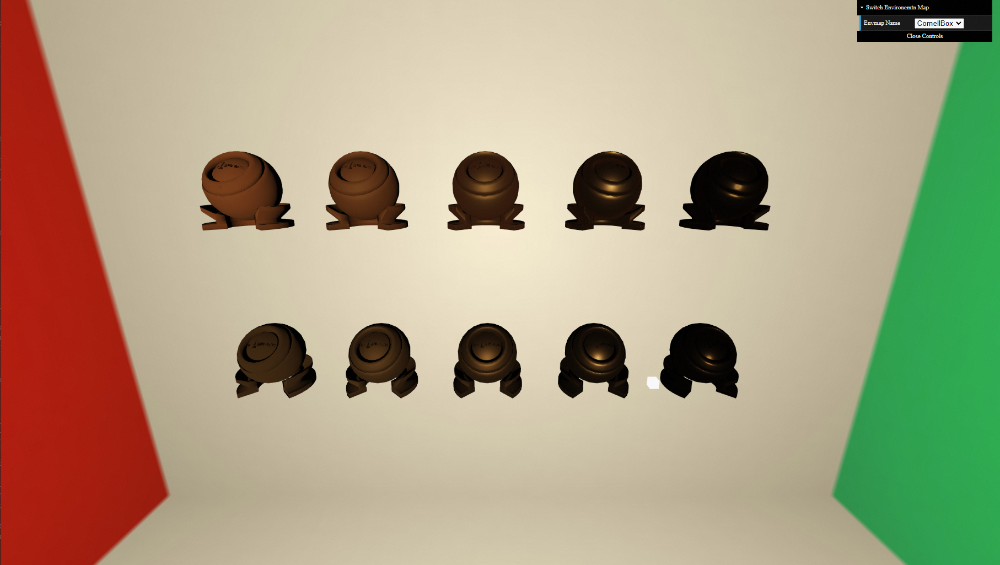
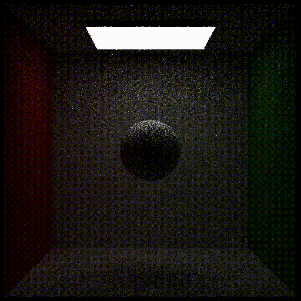
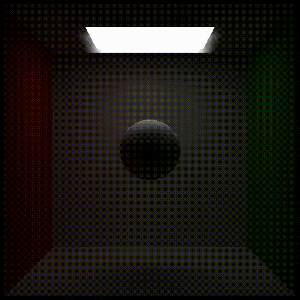
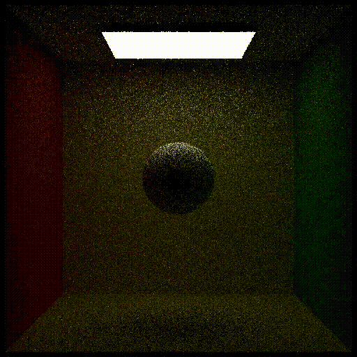

# GAMES202
The assignments of GAMES202 (Real-Time High Quality Rendering) whose instructor is Lingqi Yan, if you are interested, please refer to https://sites.cs.ucsb.edu/~lingqi/teaching/games202.html for more information. this lecture mainly includes four parts: real-time shadow, real-time global illumination, real-time high quality shading and real-time ray tracing. (shown as the following four pictures)


## Assignment 0: WebGL Architecture and Blinn-Phong shading Model

There is a problem worth mentioning here that the mary model doesn't render correctly for most of time, only 202 logo can be seen. I have tried a lot of methods to solve this problem, a more effective solution is to replace the MTLLoader.js, OBJLoader.js, OrbitControls.js and three.js with the offical ones, [here](https://github.com/mrdoob/three.js/) and [here](https://threejs.org/build/three.min.js)(three.js replaced with three.min.js).


## Assignment 1: Real-time Shadow

In this assignment, several parameters need to be tweaked to achieve a better visual shadow effect, such as sample numbers, block search size, filter size, epsilon, the othonormal projection volumn of light. Here are some tips in the process of finishing this assignment:

- to relieve aliases at the boundary of shadow, the higher the resolution of shadow map and depth information is, the better. keeping the bounding volumn of the projection matrix of light as small as possbile, just wrapping up the two models. in this way, we can overcome aliases issue effectively.
- The very first task of this assignment is generating a correct shadow map, visualing shadow map is a good idea, you may show the shadow map at the corner to help you debug. here is my showing shadow map code snippet(showShadowMap is called at the end of main function):
```C
void showShadowMap() {
  float width = 600.0;
  float height = 600.0;
  if(gl_FragCoord.x < width && gl_FragCoord.y < height) {
    float depth = unpack(texture2D(uShadowMap, gl_FragCoord.xy / vec2(width, height)));
    gl_FragColor = vec4(depth, depth, depth, 1.0);
  }
}
```
and the result:


Naive shadow map:


PCF (Percentage Closer Filter), note the difference between PCF and naive shadow map:


PCSS (Percentage Closer Soft Shadow), note the difference between PCSS and PCF:


## Assignment 2: Precomputed Radiance Transfer

I came across several problems with the base code in the process of finishing this assignment:

- the mary model is intersected with itself, which is caused by low depth precision in far distance. the closer distance to near plane is, the more depth precision is used, as a result of setting near plane with a small value, far distance has no much more precision, so the near plane distance should be set as big as possible. 
- the mary model is occluded by skybox, the implementation of skybox material in this assginment is incorrect, the NDC z coordinate of every pixel of skybox should be set as far as possible, in order to not overlap other models. here is my solution, adding a line of code at the end of vertex shader of skybox material will be OK:
```
gl_Position.z = gl_Position.w;
```
as far as handling PRT rotation is concerned, a natural way is to keep original PRT light data unchanged, and generate PRT light data with rotation again and again, here I commit one mistake which takes a lot of time to figure out before I eventually find that the source of this mistake is caused by shallow copy between original PRT light data and PRT light data with rotation, here is a trival example to illustrate this problem:

``` JavaScript
let PrecomputeL = [[], [], []];
let rotationPrecomputeL = PrecomputeL;
rotationPrecomputeL[0] = [...];
rotationPrecomputeL[1] = [...]; // the modification applied to rotationPrecomputeL also applied to PrecomputeL
```

PRT result:


PRT with rotation:


## Assignment 3: Screen Space Ray Tracing
We use defferred rendering here to generate GBuffer (which is a bunch of textures including position/depth/diffuse/normal textures and so on of all visible points on the screen), all shading related and other attributes can be fetched from these textures.

GI(Global Illumination) can be split into two parts: direct illumination and indirect illumination, which can be calculated respectively.
- All the materials in the scenes of this assignment are Lambertain ones, whose direct illumination can be computed by:
```C
vec3 EvalDirectionalLight(vec2 uv) {
  vec3 Le = GetGBufferuShadow(uv) * uLightRadiance * GetGBufferDiffuse(uv) * max(0.0, dot(uLightDir, GetGBufferNormalWorld(uv)));
  return Le;
}
```
- Indirect illumination is not as obvious as direct illumination, but it plays an important role in showing geometries that are not directly seen by the lights, adding more details in the scene. and it generally needs more computation than direct illumination. in this assignment, the computation mainly comes from two aspects:

1. More samples: indirect illumination comes from all around the shading points, only several samples can not give a precise approximation to indirect illumination. Here we use Monte Carlo numerical method and importance sampling (BRDF importance sampling) technique to estimate a better effect.

2. Ray marching: we cannot use real ray tracing approach here, instead for every ray we can only march step by step until it intersects the world or goes out of the screen space.

Sceen space GI showcases:





## Assignment 4: Kulla-Conty BRDF
Emu integration computed by Monte Carlo:


Emu integration with importance sampling:


Emu average:


Realtime Kulla-Conty multi-bounding BRDF final effect (upper row) compared with microfacet BRDF (lower row), note the brightness between two material models when roughness is low:



## Assignment 5: Real-time Ray Tracing Denoising

Several issues are worth mentioning in this assignment:
1. When we do the filtering operation, there is one step needs computing the dot product of normals of two pixels, if the normals are all normalized, it's perfectly fine. but as a matter of fact, this is not the case, as a result of this, calculating arccos of this dot product is illeal, as this dot product is out of the range [-1, 1], so a clamp operation to the dot product is needed here.
2. Just as the first problem, this problem is also caused by the given data. the world matrix of the object may not be invertible, which will cause crash when you try to tranfrom object from world space to local space with the inverse of the matrix. to avoid this problem, I modify the Inverse function to return the state whether the matrix is invertible or not, if not, I will not accumulate color value for this specified pixel.

To automically generate final result video, I write a script tool to do this (which can only run on Windows):
```bat
ffmpeg -framerate 15 -i ./examples/box/input/beauty_%%d.exr -start_number 0 -c:v libx264 -r 30 -pix_fmt yuv420p ./results/box-original.mp4
.\build\Release\Denoise.exe examples/box/input examples/box/filter 20 0
ffmpeg -framerate 15 -i ./examples/box/filter/result_%%02d.exr -start_number 0 -c:v libx264 -r 30 -pix_fmt yuv420p ./results/box-filter.mp4
.\build\Release\Denoise.exe examples/box/input examples/box/project 20 1
ffmpeg -framerate 15 -i ./examples/box/project/result_%%02d.exr -start_number 0 -c:v libx264 -r 30 -pix_fmt yuv420p ./results/box-project.mp4
.\build\Release\Denoise.exe examples/box/input examples/box/result 20 2
ffmpeg -framerate 15 -i ./examples/box/result/result_%%02d.exr -start_number 0 -c:v libx264 -r 30 -pix_fmt yuv420p ./results/box-result.mp4

ffmpeg -framerate 15 -i ./examples/pink-room/input/beauty_%%d.exr -start_number 0 -c:v libx264 -r 30 -pix_fmt yuv420p ./results/pinkroom-original.mp4
.\build\Release\Denoise.exe examples/pink-room/input examples/pink-room/filter 80 0
ffmpeg -framerate 15 -i ./examples/pink-room/filter/result_%%02d.exr -start_number 0 -c:v libx264 -r 30 -pix_fmt yuv420p ./results/pinkroom-filter.mp4
.\build\Release\Denoise.exe examples/pink-room/input examples/pink-room/project 80 1
ffmpeg -framerate 15 -i ./examples/pink-room/project/result_%%02d.exr -start_number 0 -c:v libx264 -r 30 -pix_fmt yuv420p ./results/pinkroom-project.mp4
.\build\Release\Denoise.exe examples/pink-room/input examples/pink-room/result 80 2
ffmpeg -framerate 15 -i ./examples/pink-room/result/result_%%02d.exr -start_number 0 -c:v libx264 -r 30 -pix_fmt yuv420p ./results/pinkroom-result.mp4

```
And here are the final results:

Box original video:



Box video with single frame denoise only:



Box video with frames accumulation only:



Box video final result with single frame denoise and frames accumulation:


Pink room original video:


Pink room with single frame denoise only:


Pink room with frames accumulation only:


Pink room final result with single frame denoise and frames accumulation:


