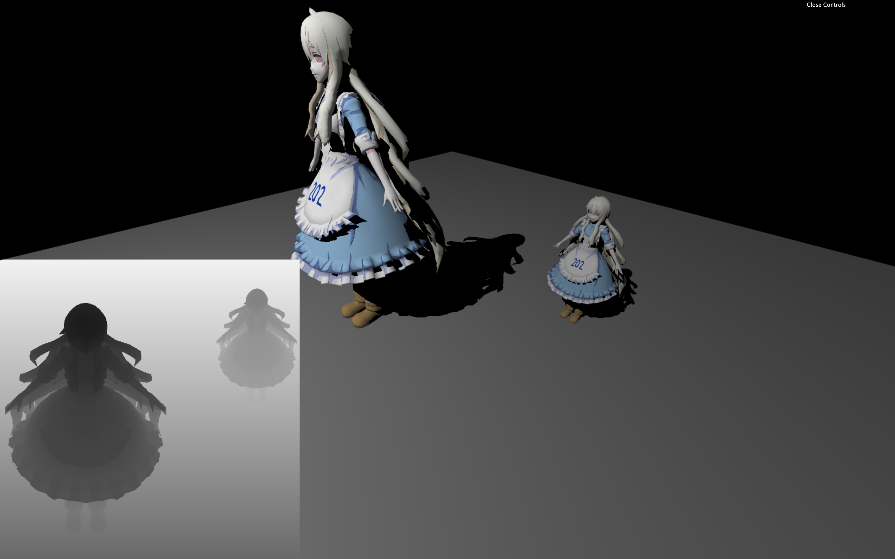
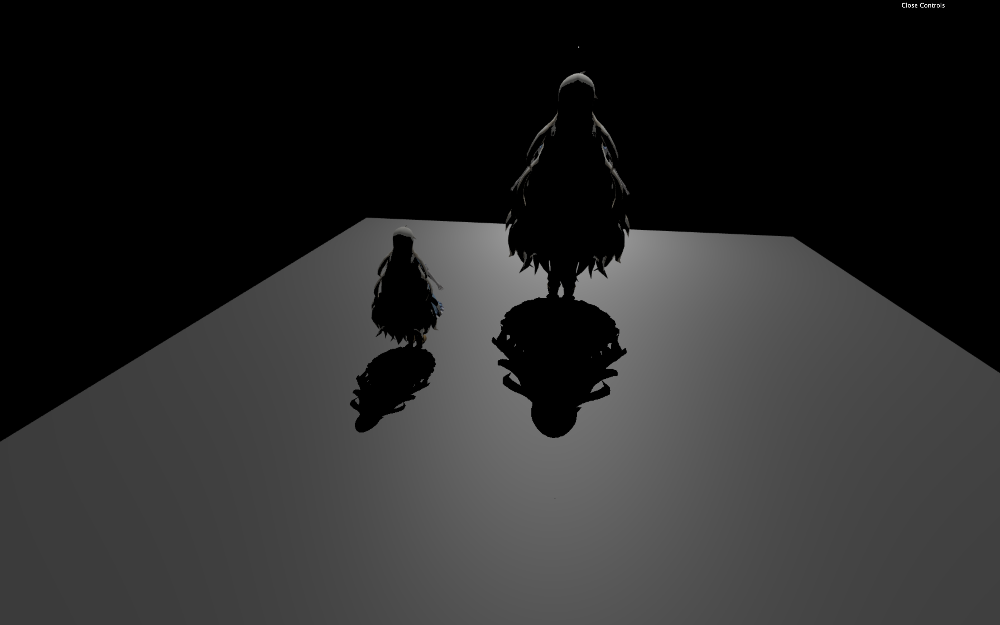
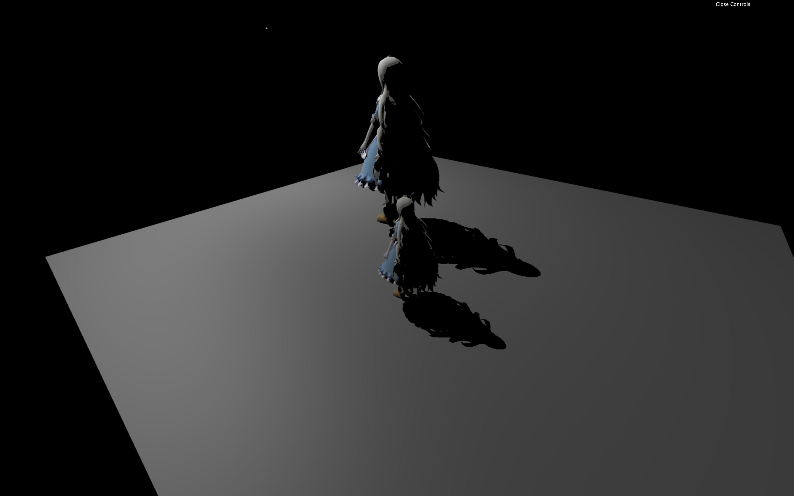
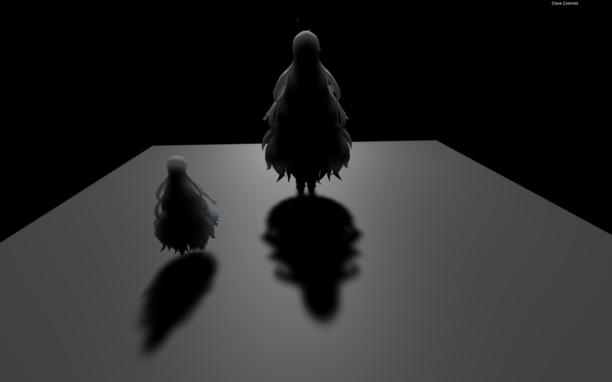
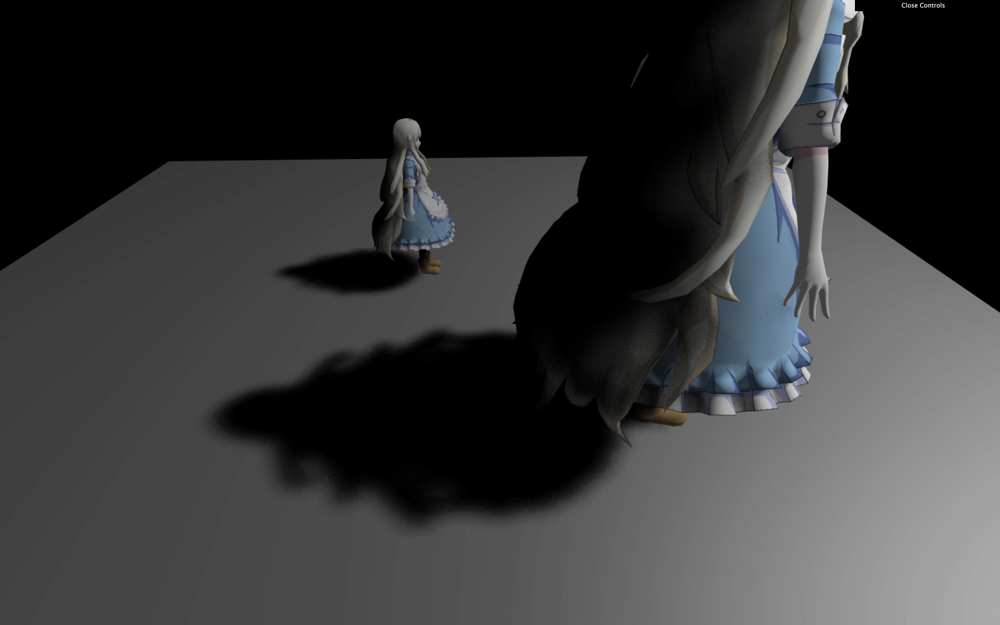
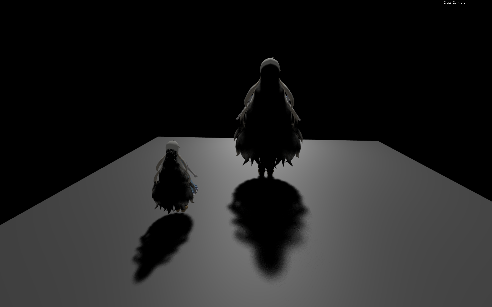
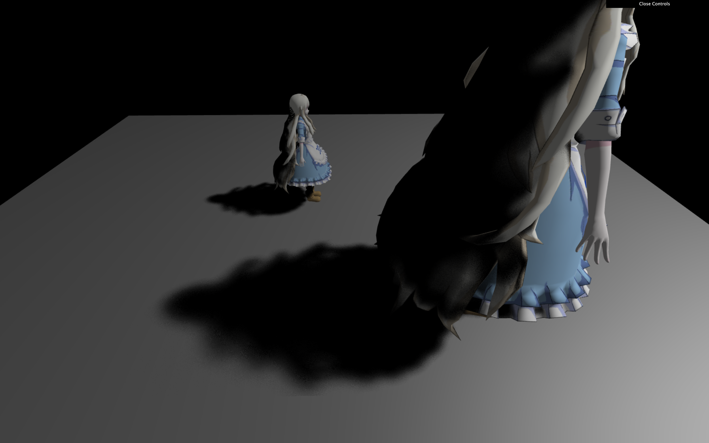

# GAMES202
The assignments of GAMES202 (Real-Time High Quality Rendering) whose instructor is Lingqi Yan, if you are interested, please refer to https://sites.cs.ucsb.edu/~lingqi/teaching/games202.html for more information. this lecture mainly includes four parts: real-time shadow, real-time global illumination, real-time high quality shading and real-time ray tracing. (shown as the following four pictures)


## Assignment 0: WebGL Architecture and Blinn-Phong shading Model

There is a problem worth mentioning here that the mary model doesn't render correctly for most of time, only 202 logo can be seen. I have tried a lot of methods to solve this problem, a more effective solution is to replace the MTLLoader.js, OBJLoader.js, OrbitControls.js and three.js with the offical ones, [here](https://github.com/mrdoob/three.js/) and [here](https://threejs.org/build/three.min.js)(three.js replaced with three.min.js).


## Assignment 1: Real-time Shadow

In this assignment, several parameters need to be tweaked to achieve a better visual shadow effect, such as sample numbers, block search size, filter size, epsilon, the othonormal projection volumn of light. Here are some tips in the process of finishing this assignment:

- to relieve aliases at the boundary of shadow, the higher the resolution of shadow map and depth information is, the better. keeping the bounding volumn of the projection matrix of light as small as possbile, just wrapping up the two models. in this way, we can overcome aliases issue effectively.
- The very first task of this assignment is generating a correct shadow map, visualing shadow map is a good idea, you may show the shadow map at the corner to help you debug. here is my showing shadow map code snippet(showShadowMap is called at the end of main function):
```C
void showShadowMap() {
  float width = 600.0;
  float height = 600.0;
  if(gl_FragCoord.x < width && gl_FragCoord.y < height) {
    float depth = unpack(texture2D(uShadowMap, gl_FragCoord.xy / vec2(width, height)));
    gl_FragColor = vec4(depth, depth, depth, 1.0);
  }
}
```
and the result:



Naive shadow map:





PCF (Percentage Closer Filter), note the difference between PCF and naive shadow map:





PCSS (Percentage Closer Soft Shadow), note the difference between PCSS and PCF:





## Assignment 2: Precomputed Radiance Transfer

I came across several problems with the base code in the process of finishing this assignment:

- the mary model is intersected with itself, which is caused by low depth precision in far distance. the closer distance to near plane is, the more depth precision is used, as a result of setting near plane with a small value, far distance has no much more precision, so the near plane distance should be set as big as possible. 
- the mary model is occluded by skybox, the implementation of skybox material in this assginment is incorrect, the NDC z coordinate of every pixel of skybox should be set as far as possible, in order to not overlap other models. here is my solution, adding a line of code at the end of vertex shader of skybox material will be OK:
```
gl_Position.z = gl_Position.w;
```

PRT result:


PRT with rotation:


